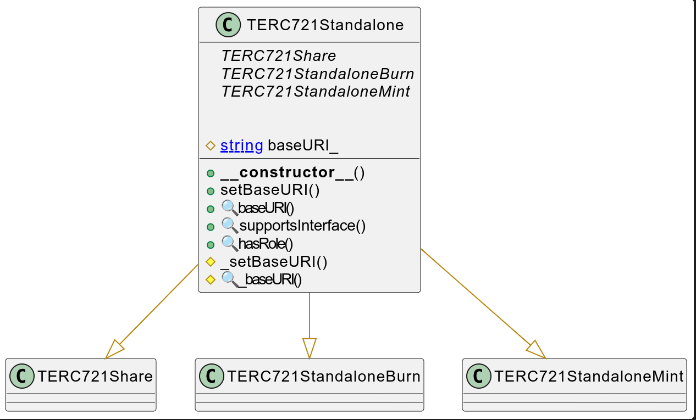
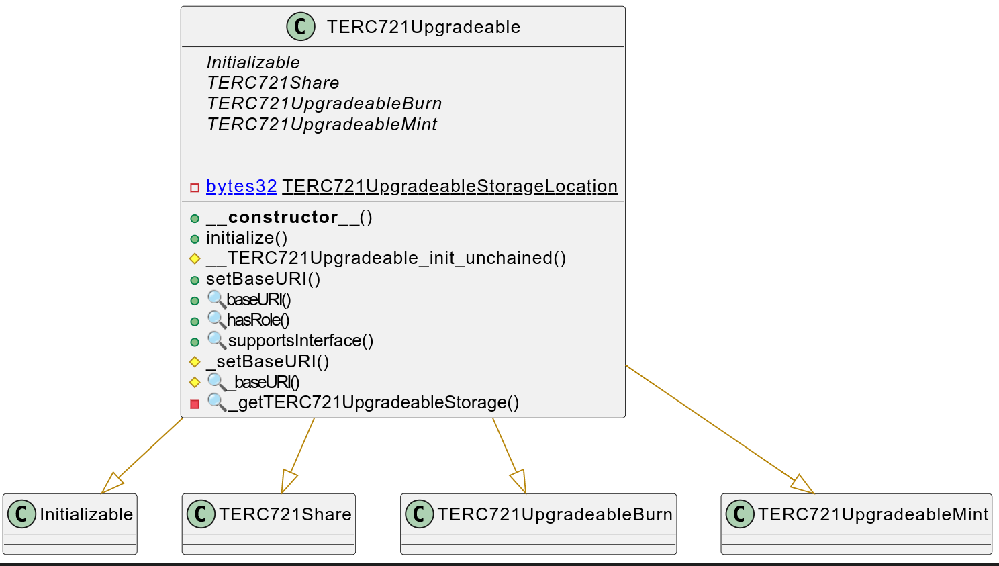
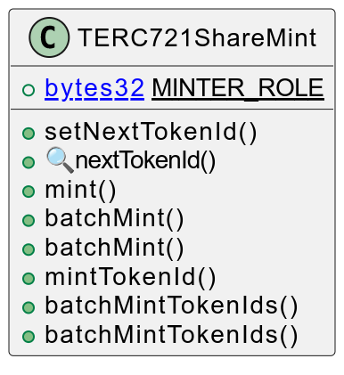
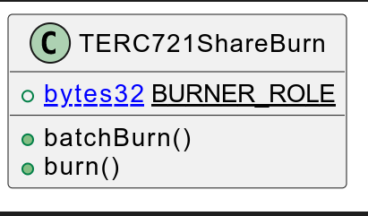
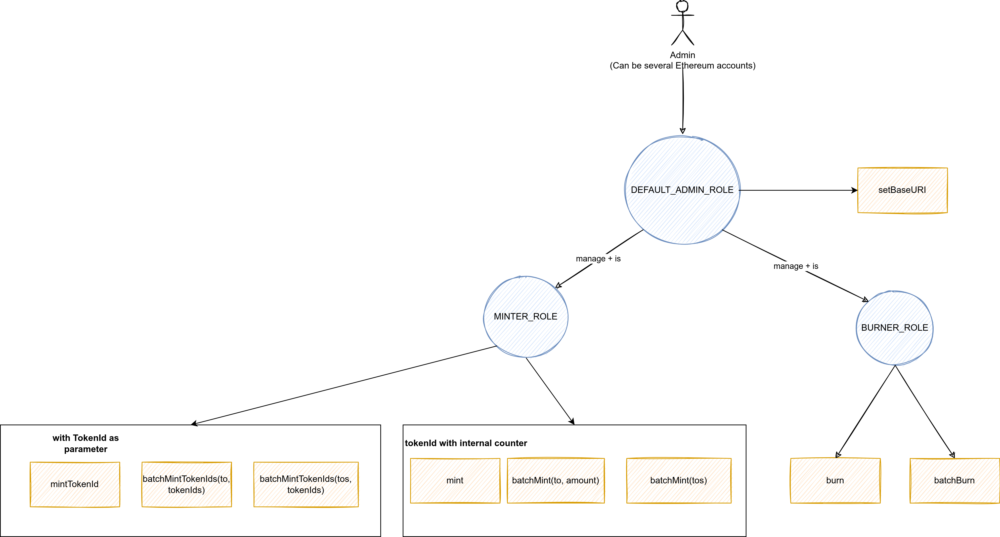
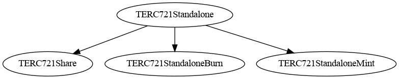
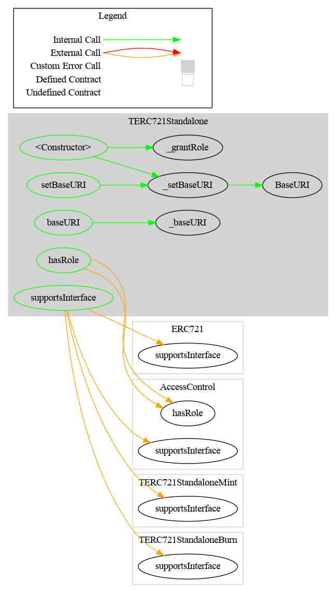
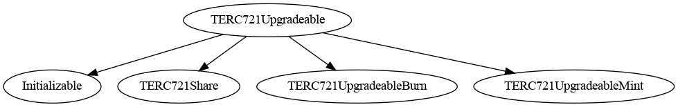
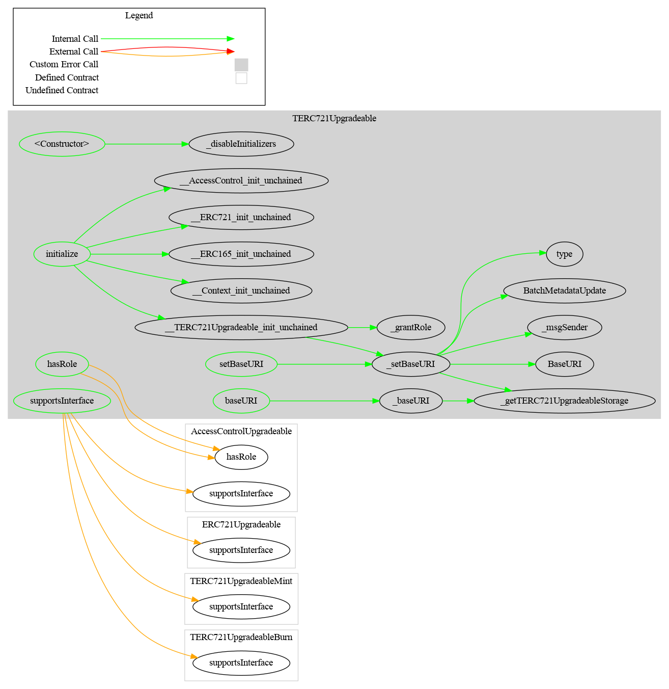
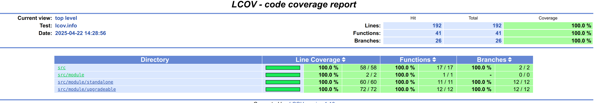

# TERC-721

[ERC-721](https://eips.ethereum.org/EIPS/eip-721) is the main standard to represent non-fungibles tokens (NFT) on Ethereum and EVM blockchain. This ERC defines the functions, events and the behavior of a token implementing this interface.

One of the main libraries used to build ERC-721 contract is OpenZeppelin. This library provides already all functions which are part of the standard. Nevertheless, OpenZeppelin does not provide a deployable contract, but only an [abstract](https://docs.soliditylang.org/en/v0.8.28/contracts.html#abstract-contracts) contract which can be used to build other contracts though inheritance but cannot be deployed directly on the blockchain. You can find more information about their implementation in their [documentation](https://docs.openzeppelin.com/contracts/5.x/erc721). 

TERC-721 aims to provide a minimal deployable implementation for standalone deployment (immutable) and proxy deployment (upgradeable) which allows the issuer (and only him) to mint and burn tokens. 

TERC-721 exists in two different version: standalone and proxy:

- `TERC721Standalone` for an immutable deployment, without proxy



- `TERC721Upgradeable` for an upgradeable deployment, with a compatible proxy (Transparent or Beacon)



[TOC]

## ERC

In addition to ERC-721, TERC-721 uses the following ERCs:

- [ERC-4906](https://eips.ethereum.org/EIPS/eip-4906): emit `BatchMetadataUpdate`when the baseURI is updated
- [ERC-6093](https://eips.ethereum.org/EIPS/eip-6093): Custom errors for ERC-721 tokens (through OpenZeppelin)
- [eip-3643](https://eips.ethereum.org/EIPS/eip-3643): implements the following function: `version()`
- TERC721Upgradeable only: 
  - implements [ERC-7201](https://eips.ethereum.org/EIPS/eip-7201) to manage the storage location.

## Common characteristics

These ERC-721 tokens have the following characteristics:

**Mint**

- Mint functions only accessible with the MINTER role

- Batch mint functions only accessible with the MINTER role



**Burn**

- A burn function only accessible with the BURNER role
- A batch burn function only accessible with the BURNER role



**ERC721**

- At deployment, the issuer can set the name, symbol and the baseURI

- Once deployed, it is no longer possible to modify the name and symbol except via an upgrade in the case of the proxy. A setter function is available to set the `baseURI` again.

## Access Control

There are three roles: MINTER_ROLE, BURNER_ROLE and DEFAULT_ADMIN_ROLE

The DEFAULT_ADMIN_ROLE has all the roles by default




## Schema

### TERC721Standalone

#### Inheritance



#### Graph




### TERC721 Upgradeable

#### Inheritance



#### Graph



## Surya Description Report

### Contracts Description Table

#### TERC721Standalone

|       Contract        |       Type        |                           Bases                            |                |               |
| :-------------------: | :---------------: | :--------------------------------------------------------: | :------------: | :-----------: |
|           └           | **Function Name** |                       **Visibility**                       | **Mutability** | **Modifiers** |
|                       |                   |                                                            |                |               |
| **TERC721Standalone** |  Implementation   | TERC721Share, TERC721StandaloneBurn, TERC721StandaloneMint |                |               |
|           └           |   <Constructor>   |                          Public ❗️                          |       🛑        |    ERC721     |
|           └           |    setBaseURI     |                          Public ❗️                          |       🛑        |   onlyRole    |
|           └           |      baseURI      |                          Public ❗️                          |                |      NO❗️      |
|           └           | supportsInterface |                          Public ❗️                          |                |      NO❗️      |
|           └           |      hasRole      |                          Public ❗️                          |                |      NO❗️      |
|           └           |    _setBaseURI    |                         Internal 🔒                         |       🛑        |               |
|           └           |     _baseURI      |                         Internal 🔒                         |                |               |

##### TERC721StandaloneMint

|         Contract          |       Type        |                  Bases                  |                |               |
| :-----------------------: | :---------------: | :-------------------------------------: | :------------: | :-----------: |
|             └             | **Function Name** |             **Visibility**              | **Mutability** | **Modifiers** |
|                           |                   |                                         |                |               |
| **TERC721StandaloneMint** |  Implementation   | ERC721, AccessControl, TERC721ShareMint |                |               |
|             └             |    mintTokenId    |                Public ❗️                 |       🛑        |   onlyRole    |
|             └             | batchMintTokenIds |                Public ❗️                 |       🛑        |   onlyRole    |
|             └             | batchMintTokenIds |                Public ❗️                 |       🛑        |   onlyRole    |
|             └             |    nextTokenId    |                Public ❗️                 |                |      NO❗️      |
|             └             |  setNextTokenId   |                Public ❗️                 |       🛑        |   onlyRole    |
|             └             |       mint        |                Public ❗️                 |       🛑        |   onlyRole    |
|             └             |     batchMint     |                Public ❗️                 |       🛑        |   onlyRole    |
|             └             |     batchMint     |                Public ❗️                 |       🛑        |   onlyRole    |
|             └             | supportsInterface |                Public ❗️                 |                |      NO❗️      |
|             └             |   _mintAndEvent   |               Internal 🔒                |       🛑        |               |

##### TERC721StandaloneBurn

|         Contract          |       Type        |                  Bases                  |                |               |
| :-----------------------: | :---------------: | :-------------------------------------: | :------------: | :-----------: |
|             └             | **Function Name** |             **Visibility**              | **Mutability** | **Modifiers** |
|                           |                   |                                         |                |               |
| **TERC721StandaloneBurn** |  Implementation   | ERC721, AccessControl, TERC721ShareBurn |                |               |
|             └             |       burn        |                Public ❗️                 |       🛑        |   onlyRole    |
|             └             |     batchBurn     |                Public ❗️                 |       🛑        |   onlyRole    |
|             └             | supportsInterface |                Public ❗️                 |                |      NO❗️      |

#### TERC721Upgradeable

|        Contract        |                Type                 |                            Bases                             |                |                  |
| :--------------------: | :---------------------------------: | :----------------------------------------------------------: | :------------: | :--------------: |
|           └            |          **Function Name**          |                        **Visibility**                        | **Mutability** |  **Modifiers**   |
|                        |                                     |                                                              |                |                  |
| **TERC721Upgradeable** |           Implementation            | Initializable, TERC721Share, TERC721UpgradeableBurn, TERC721UpgradeableMint |                |                  |
|           └            |            <Constructor>            |                           Public ❗️                           |       🛑        |       NO❗️        |
|           └            |             initialize              |                           Public ❗️                           |       🛑        |   initializer    |
|           └            | __TERC721Upgradeable_init_unchained |                          Internal 🔒                          |       🛑        | onlyInitializing |
|           └            |             setBaseURI              |                           Public ❗️                           |       🛑        |     onlyRole     |
|           └            |               baseURI               |                           Public ❗️                           |                |       NO❗️        |
|           └            |               hasRole               |                           Public ❗️                           |                |       NO❗️        |
|           └            |          supportsInterface          |                           Public ❗️                           |                |       NO❗️        |
|           └            |             _setBaseURI             |                          Internal 🔒                          |       🛑        |                  |
|           └            |              _baseURI               |                          Internal 🔒                          |                |                  |
|           └            |    _getTERC721UpgradeableStorage    |                          Private 🔐                           |                |                  |


##### TERC721UpgradeableMint

|          Contract          |               Type                |                            Bases                             |                |               |
| :------------------------: | :-------------------------------: | :----------------------------------------------------------: | :------------: | :-----------: |
|             └              |         **Function Name**         |                        **Visibility**                        | **Mutability** | **Modifiers** |
|                            |                                   |                                                              |                |               |
| **TERC721UpgradeableMint** |          Implementation           | ERC721Upgradeable, AccessControlUpgradeable, TERC721ShareMint |                |               |
|             └              |            mintTokenId            |                           Public ❗️                           |       🛑        |   onlyRole    |
|             └              |         batchMintTokenIds         |                           Public ❗️                           |       🛑        |   onlyRole    |
|             └              |         batchMintTokenIds         |                           Public ❗️                           |       🛑        |   onlyRole    |
|             └              |            nextTokenId            |                           Public ❗️                           |                |      NO❗️      |
|             └              |          setNextTokenId           |                           Public ❗️                           |       🛑        |   onlyRole    |
|             └              |               mint                |                           Public ❗️                           |       🛑        |   onlyRole    |
|             └              |             batchMint             |                           Public ❗️                           |       🛑        |   onlyRole    |
|             └              |             batchMint             |                           Public ❗️                           |       🛑        |   onlyRole    |
|             └              |         supportsInterface         |                           Public ❗️                           |                |      NO❗️      |
|             └              |           _mintAndEvent           |                          Internal 🔒                          |       🛑        |               |
|             └              | _getTERC721UpgradeableMintStorage |                          Private 🔐                           |                |               |

##### TERC721UpgradeableBurn

|          Contract          |       Type        |                            Bases                             |                |               |
| :------------------------: | :---------------: | :----------------------------------------------------------: | :------------: | :-----------: |
|             └              | **Function Name** |                        **Visibility**                        | **Mutability** | **Modifiers** |
|                            |                   |                                                              |                |               |
| **TERC721UpgradeableBurn** |  Implementation   | ERC721Upgradeable, AccessControlUpgradeable, TERC721ShareBurn |                |               |
|             └              |       burn        |                           Public ❗️                           |       🛑        |   onlyRole    |
|             └              |     batchBurn     |                           Public ❗️                           |       🛑        |   onlyRole    |
|             └              | supportsInterface |                           Public ❗️                           |                |      NO❗️      |

### Legend

| Symbol | Meaning                   |
| :----: | ------------------------- |
|   🛑    | Function can modify state |
|   💵    | Function is payable       |

## Dependencies

The toolchain includes the following components, where the versions are the latest ones that we tested:

- Foundry
- Solidity 0.8.28 (via solc-js)
- OpenZeppelin Contracts (submodule) [v5.3.0](https://github.com/OpenZeppelin/openzeppelin-contracts/releases/tag/v5.3.0)
- OpenZeppelin Contracts upgradeable (submodule) [v5.3.0](https://github.com/OpenZeppelin/openzeppelin-contracts/releases/tag/v5.3.0)

## Audit

See [report](doc/audit/SecfaultSecurity_Report_Review_ERC721_v1.0.pdf) made by [SecFault Security](https://secfault-security.com)

The audit was performed  on the version 0.2.0 and the version containing the fix is the version 1.0.0

The functions `setNextTokenId`and `nextTokenId`have been added in the version 1.0.0 and therefore were not included in the audit.

### Audit tools

#### Slither

[Report file](./doc/audit/tool/slither-report.md)

See [crytic/slither](https://github.com/crytic/slither)

```bash
slither .  --checklist --filter-paths "openzeppelin-contracts|openzeppelin-contracts-upgradeable|test|forge-std" > slither-report.md
```

#### Mythril

[Report file](./doc/audit/tool/mythril-report.md)

```bash
myth analyze src/TERC721Standalone.sol --solc-json solc_setting.json
```

See [Consensys/mythril](https://github.com/Consensys/mythril)

#### Cyfrin Aderyn

[Report file](./doc/audit/tool/aderyn-report.md)

```bash
aderyn --output report.md
```

See [Cyfrin/aderyn](https://github.com/Cyfrin/aderyn)

## Tools

### Surya

See [./doc/script](./doc/script) and [Consensys/surya](https://github.com/Consensys/surya)

### Prettier

```bash
npx prettier --write --plugin=prettier-plugin-solidity 'src/**/*.sol'
```

```bash
npx prettier --write --plugin=prettier-plugin-solidity 'test/**/*.sol'
```

### Surya

See [./doc/script](./doc/script)

### Foundry

Foundry is a blazing fast, portable and modular toolkit for Ethereum application development written in Rust.

Foundry consists of:

-   **Forge**: Ethereum testing framework (like Truffle, Hardhat and DappTools).
-   **Cast**: Swiss army knife for interacting with EVM smart contracts, sending transactions and getting chain data.
-   **Anvil**: Local Ethereum node, akin to Ganache, Hardhat Network.
-   **Chisel**: Fast, utilitarian, and verbose solidity REPL.

## Usage

*Explain how it works.*


### Toolchain installation

The contracts are developed and tested with [Foundry](https://book.getfoundry.sh), a smart contract development toolchain.

To install the Foundry suite, please refer to the official instructions in the [Foundry book](https://book.getfoundry.sh/getting-started/installation).

### Initialization

You must first initialize the submodules, with

```bash
forge install
```

See also the command's [documentation](https://book.getfoundry.sh/reference/forge/forge-install).

Later you can update all the submodules with:

```bash
forge update
```

See also the command's [documentation](https://book.getfoundry.sh/reference/forge/forge-update).

### Compilation

The official documentation is available in the Foundry [website](https://book.getfoundry.sh/reference/forge/build-commands) 

```bash
 forge build
```

### Testing

You can run the tests with

```bash
forge test --ffi
```

To run a specific test, use

```bash
forge test --match-contract <contract name> --match-test <function name>
```

See also the test framework's [official documentation](https://book.getfoundry.sh/forge/tests), and that of the [test commands](https://book.getfoundry.sh/reference/forge/test-commands).

### Coverage



* Perform a code coverage

```bash
forge coverage
```

* Generate LCOV report

```bash
forge coverage --report lcov
```

- Generate `index.html`

```bash
forge coverage --ffi --report lcov && genhtml lcov.info --branch-coverage --output-dir coverage
```

See [Solidity Coverage in VS Code with Foundry](https://mirror.xyz/devanon.eth/RrDvKPnlD-pmpuW7hQeR5wWdVjklrpOgPCOA-PJkWFU) & [Foundry forge coverage](https://www.rareskills.io/post/foundry-forge-coverage)

### Documentation

[https://book.getfoundry.sh/](https://book.getfoundry.sh/)

## OpenSea integration

### Burn mechanism

The burn mechanism implemented in TERC721 is not compatible with the OpenSea guideline

> We don’t allow NFTs that are guaranteed to be burned or burned at the full discretion of the creator. There must be an element of randomization, chance, or an event that triggers the burn

See [OpenSea support - How does OpenSea handle NFTs with a burn mechanism?](https://support.opensea.io/en/articles/8867074-how-does-opensea-handle-nfts-with-a-burn-mechanism)

### Metadata update (ERC-4906)

The contract emits the event `BatchMetadataUpdate`when the baseURI is updated as supported by OpenSea to refresh token metadata.

> To refresh a whole collection, emit `_toTokenId` with `type(uint256).max`

See [docs.opensea - metadata updates](https://docs.opensea.io/docs/metadata-standards#metadata-updates)

## Intellectual property

The original code is copyright (c) Taurus 2025, and is released under [MIT license](https://github.com/taurushq-io/tg-bridge-contracts-CCIP/blob/main/LICENSE).
